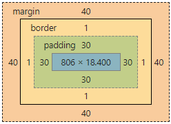

# Huawei_Classroom_WebFrontEnd
This repository is code base for learning web front end knowledge in the Huawei Classroom

Some format notes:

* All **tags**/**elements** will be **Bold**
* All tag *attributes* will be *Italic*
* All attribute "values" will be "quoted"

## Content - HTML
This part is the basic knowledge of HTML, specific the usage of HTML tags
### Chapter 2


### Chapter 5
This chapter is to learn the **form** tag

Code directory: [HTML_Chapter5.html](https://github.com/SteveZhao13/Huawei_Classroom_WebFrontEnd/blob/master/HTML_Chapter5.html)

* **form** tag has a *action* attribute and a *method* attribute. *action* is to show where the data of the from goes; *action* is the way to deliver data
* all the following tags should be included in the **form** tag
    * **input** tag can be used in various places, use *type* attribute to differ different usage: "text" - input text ; "radio" - single selection; "checkbox" - multiple selection; "button" - normal button; "submit" - submit data to database; "reset" - clear form content; "file" - upload files
    * **input** tag should have the same *name* attribute value for the same amount of selections, e.g. if there are 5 choices of *radio* type of **input** tags, all the **input** tags should have the same *name*; However, the *value* attribute should be different for each tag, because it's used to differ choices for the back-end database
    * **select** tag is used to make scroll-down menu, it should be used along with **option** tags. *selected* attribute is used to change the default option
    * **textarea** tag is used to create a multi-line text input area. Using *cols* and *rows* attributes can control the size of the area

## Content - CSS
This part is the basic knowledge of CSS

### Chapter 1
This chapter is a brief introduction to CSS

Code directory: [CSS_Chapter1.html](https://github.com/SteveZhao13/Huawei_Classroom_WebFrontEnd/blob/master/CSS_Chapter1.html) and [CSS_Chapter1.css](https://github.com/SteveZhao13/Huawei_Classroom_WebFrontEnd/blob/master/CSS_Chapter1.css)

##### There are THREE ways to insert a CSS style sheet into a HTML web page
> Inline CSS: An inline style is used to apply a unique style for `a single element`
> * How to use: add the *style* attribute to the relevant element
>
> Internal CSS: An internal style is used to apply a unique style for `a single HTML page`
> * How to use: define the style inside the **style** tag, inside the **head** section
>
> External CSS: An external style sheet is used to change the look of `an entire website`
>    * How to use: add a reference to the external style sheet file inside the **link** tag, inside the **head** section

##### CSS Syntax
```css
Selector-1, Selector-2 { Property-1: Value-1; Property-2: Value-2; }
```
> **Notes:**
> 1. Use ";" to separate different properties
> 2. Use "," to group multiple tags and set them to the same style

> Characteristics:
> 1. Only the latest(code in the bottom) property value is showed if multiple same properties are defined
> 2. Some properties(mostly related to text) of parent tags can be inherited by child tags

### Chapter 2
This chapter is a description to CSS Selectors

Code directory: [CSS_Chapter2.html](https://github.com/SteveZhao13/Huawei_Classroom_WebFrontEnd/blob/master/CSS_Chapter2.html) and [CSS_Chapter2.css](https://github.com/SteveZhao13/Huawei_Classroom_WebFrontEnd/blob/master/CSS_Chapter2.css)

##### Types of CSS Selectors

1. Universal selector (*): used to define styles for all HTML elements on one page
2. Element selector (**h1**, **div**, **p**, etc): used to define style for a specific HTML element
3. Id selector (#*id*): used to define style for a element with unique *id* value

> **Note:** *id* attribute is unique in one HTML page; "id_value" should contain NO spaces and start with a character

4. Class selector (.*class* or **tag**.*class*): used to define styles for a class of elements

> **Note:** 
> *class* attribute can be used to cluster several elements into a group or a class. We can also specify certain elements to be affected by a class by using following syntax
> ```css
> tag.class {property: value}
> ```

5. Attribute selector (**tag**[*attribute*], **tag**[*attribute*="value"] or **tag**[*attribute*~="value"], etc): used to define styles for tag(s) with certain attributes

6. Pseudo-classes selector (**tag**:pseudo-class): often comes together with **a** tag to define styles of a link

> **Notes:**
> pseudo-classes should contain certain orders to take effect
> ```css
> a.link {property: value}
> a.visited {property: value}
> a.hover {property: value}
> a.active {property: value}
> ```

7. Contextual selector: used when selectors need to match elements that appear in a context
    * Descendant selector (**ancestor_tag** **descendant_tag**): all descendant tags will have the same style
    * Child selector (**father_tag** > **child_tag**): only child tags will have the style (grandson tag won't take effect)
    * Adjacent sibling selector (**sibling_tag_1** + **sibling_tag_2**)
    
##### Weights of CSS Selectors

> The HTML page will show the style of the Largest Weights
>
> * Universal Selector (*): 0
> * Element Selector (**tag**): 1 
> * Class Selector (.class), Pseudo-classes Selector (**tag**:pseudo-class) and Attribute Selector (**tag**[*attribute*]): 10
> * Id Selector (#*id*): 100
> * Inline CSS style Selectors: 1000
> * Selectors with *!important* value: Unlimited
>
> **Note:** Different selectors can be combined to get a larger weight

### Chapter 3
This chapter is to learn common used CSS Attributes

Code directory: [CSS_Chapter3.html](https://github.com/SteveZhao13/Huawei_Classroom_WebFrontEnd/blob/master/CSS_Chapter3.html) and [CSS_Chapter3.css](https://github.com/SteveZhao13/Huawei_Classroom_WebFrontEnd/blob/master/CSS_Chapter3.css)

##### Font
1. *font-family*: which kind of fonts will be used (e.g. "serif", "monospace")
2. *font-size*: how big the font is (e.g. "30px", "50%")
3. *font-style*: how the font will be italic (e.g. "italic", "normal")
4. *font-weight*: how bold the font is (e.g. "bold", "200")

> **Note:** we can combine different font attribute into one *font* attribute, for example below (order matters). This also applies to *list-style* and *background* attributes.
> ``` css 
> p {font: italic bolder 30px serif;}
> ```

##### Text
1. *color*: used to change text color (e.g. "red", "#ff0000", "rgb(155,0,0)")
2. *line-height*: used to change how high a line is (e.g. "50px")
3. *text-align*: used to set align type of text (e.g. "center", "right")
4. *direction*: used to set text direction (e.g. "rtl", "ltr")
5. *text-indent*: used to set indent at the beginning of text (e.g. "50px", "2em")
6. *text-decoration*: used to add a decoration line above/below/through the text (e.g. "line-through", "underline")
7. *letter-spacing*: used to set spacing between characters (e.g. "10px", "-3px")
8. *text-shadow*: (e.g. "5px 5px 2px yellow")

> **Note:** *text-shadow* syntax is as below
> ``` css 
> p {text-shadow: x-offset y-offset blur radius color;}
> ``` 

##### Size
1. *height*/*width*: set height or width of a part of the window (e.g. "20px")
2. *min-height*/*min-width*: set the minimum height or width of a part of the window (e.g. "10px")
3. *max-height*/*max-width*: set the maximum height or width of a part of the window (e.g. "50px")

> **Note:** if *height*/*width* > *max-height*/*max-width* or *height*/*width* < *min-height*/*min-width*, it will use the boundary values of *max-height*/*max-width* or *min-height*/*min-width*

##### List
1. *list-style-type*: set icon shape of the list (e.g. "circle", "square", "decimal")
2. *list-style-image*: set a image as the list icon (e.g. "url(icon.png)")
3. *list-style-position*: set the position of the list icon (e.g. "inside", "outside")

> **Note:** *list-style-type* and *list-style-image* attributes cannot be showed at the same time. However, in a real HTML project, these two attributes are often written at the same time. Because some web browsers don't support *list-style-image* attribute, we will use *list-style-type* as a backup plan

##### Background
1. *background-color*: set a background color (e.g. "red", "#ff0000", "rgb(255,0,0)")
2. *background-image*: set a image as background (e.g. "url(bg.png)")
3. *background-repeat*: control how the image repeats if the background window is larger than the image (e.g. "no-repeat", "repeat-x", "repeat-y")
4. *background-position*: set the position of the background image (e.g. "left center", "50% 50%", "100px 50px")

> **Note:** for *background-position* attribute, zero point is the left-top of the background, syntax is as below
> ``` css
> div {background-position: "x-offset y-offset";}
> ```
> "x-offset" can be set to: left, center, right/10px/20%; "y-offset" can be set to: top, center, bottom/20px/50%

5. *background-attachment*: set if the background image will be fixed or scrolled with the page (e.g. "fixed", "scroll")

### Chapter 4
This chapter is to learn Box Model of CSS

CSS Box Model consists of 4 parts: Content (内容), Padding(内边距), Border(边框) and Margin(外边距)

```css
div { padding: 30px; border: 1px solid red; margin: 40px; }
```




Code directory: [CSS_Chapter4.html](https://github.com/SteveZhao13/Huawei_Classroom_WebFrontEnd/blob/master/CSS_Chapter4.html) and [CSS_Chapter4.css](https://github.com/SteveZhao13/Huawei_Classroom_WebFrontEnd/blob/master/CSS_Chapter4.css)

##### Padding

*padding-top*/*padding-bottom*/*padding-left*/*padding-right*: used to set the padding values for different directions (e.g. "10px")

> **Note_1:** we can use *padding* attribute to combine the above four attributes, syntax is like below. The order matters (clock-rise from top).
> ```css
> div { padding: 10px 20px 30px 40px; } /* order: top right bottom left */
> ```

> **Note_2:** if we want to ignore some of the four values, the values will represent the following padding values:
> ```css
> div { padding: 10px; } /* all 4 directions have the same padding value of 10px */
> div { padding: 10px 20px; } /* top/bottom:10px right/left:20px */
> div { padding: 10px 20px 30px; } /* top:10px right/left:20px bottom:30px */
> ```

##### Border
1. *border-style*: set the border style (e.g. "solid", "dashed", "dotted", "double")
2. *border-width*: set the width of border (e.g. "thick", "thin", "2px")
3. *border-color*: set the color of border (e.g. "red", "#ff0000", "rgb(255,0,0)")

> **Note:** we can use *border* attribute to set the style/width/color of border at the same time, and width/color can be ignored
> ```css
> div { border: solid 2px red; }
> ```

4. *border-top*/*border-right*/*border-bottom*/*border-left*: set the style/width/color of a border part separately (e.g. "dashed 1px red")

##### Margin
*margin-top*/*margin-bottom*/*margin-left*/*margin-right*: used to set the value of margin for different directions (e.g. "10px", "auto")

> **Note_1:** we can use *margin* attribute to combine the above four attributes. The order will be the same as how *padding*  attribute acts

> **Note_2:** "auto" value of *margin* attribute will set the maximum possible value of the certain direction. So if both *margin-right* and *margin-left* are set to "auto", the box will be in the center of the window part

> **Tips and Testing Points 面试试题**
>
> <u>Question:</u> If two adjacent `block elements` both set *margin* attribute values "margin-1" and "margin-2", what will be the actual distance between these two elements?
>
> <u>Answer:</u> <b><i>max("margin-1", "margin-2")</i></b>
>
> <u>Question:</u> If two adjacent `inline elements` both set *margin* attribute values "margin-1" and "margin-2", what will be the actual distance between them?
>
> <u>Answer:</u> <b><i>"margin-1"+"margin-2"</i></b>

##### Display
*display* attribute is used to control how the element will show in the page (e.g. "inline", "block", "inline-block", "none")
* "inline": will set any element show as a inline element
* "block": will set any element show as a block element
* "inline-block": will set any element show as a inline-block element
* "none": will hide the element

> **Note:** `inline-block` element will have attributes of both inline element and block element. For example, it won't occupy the entire space and start on new line which is like inline elements. However, it will have width and height attributes just like block elements


> **Tips and Testing Points 面试试题**
>
> <u>Question:</u> How to make two `inline elements` tightly adjacent without any gaps
>
> <u>Answer:</u> Two ways. One is to write them together <b><i>without Line Breaks and Spacing</i></b>. The other is to set a global *font-size*="0px"

### Chapter 5
This chapter is to learn CSS *float* Attribute

Code directory: [CSS_Chapter5.html](https://github.com/SteveZhao13/Huawei_Classroom_WebFrontEnd/blob/master/CSS_Chapter5.html) and [CSS_Chapter5.css](https://github.com/SteveZhao13/Huawei_Classroom_WebFrontEnd/blob/master/CSS_Chapter5.css)

[A web page layout](https://github.com/SteveZhao13/Huawei_Classroom_WebFrontEnd/blob/master/Assignment_CSS_Chapter5.html) to show three elements in the same level, and the width of the middle element will adjust automatically according to its parent element

##### Float
*float* attribute is used to change the position of a certain element, property values could be "none", "left" or "right"

> **Note:** once *float* attribute is used, then the element will have the following features:
>
> 1. Any element with *float* attribute will become a `block element`, no matter what it is before
>
> 2. Elements with *float* attribute will cause its parent element to collapse (height of parent element would literally become 0) if the parent element only contains float elements. Below is a example of parent element collapsing
> 

##### Clear
*clear* attribute is used to clear float, this will save its parent element from collapsing, property values could be "none", "left", "right" or "both"

> **Note:** *clear* attribute should be used by a `block element` after the element with *float* attribute

##### Overflow
*overflow* attribute is used to control what happens to content that is too big to fit into an area, property values could be "visible", "hidden", "scroll" or "auto". Meanings of those values are as following

* "visible": default value, the overflow is not clipped and the content renders outside the element's box
* "hidden": the overflow is clipped and the rest of the content will be invisible
* "scroll": the overflow is clipped and a scrollbar is added to see the rest of the content
* "auto":sSimilar to scroll, but it adds scrollbars only when necessary

> **Note:** *overflow* attribute can also be used to clear float and save the parent element from collapsing. To do so, we should add *overflow* attribute into the parent element with "hidden" value

> **Tips and Testing Points 面试试题**
>
> <u>Question:</u> How to `avoid collapsing` when using *float* attribute
>
> <u>Answer:</u> Many ways. First is to set *height* attribute value to the parent element (not very good and has constrains). The second way is to use *clear* attribute to a block element after the element with *float* attribute. The third way is to set *overflow* attribute to the parent element with "hidden" value
>
> <u>Best Answer:</u> Use `clearfix hack` (which is used by most webpages). Just add "clearfix" as a class name into the parent element
>
> ```html
> <div class="parent-element-name clearfix"><div>
> ```
>
> ```css
> /* below code snippet can be encapsulated and used in any webpage */
> .clearfix:after {
>     /* attributes that must exist */
>     content: "";
>     clear: both;
>     display: block;
>     /* attributes that are optional, just to make sure it's not showing */
>     height: 0px;
>     font-size: 0px;
>     visibility: hidden;
> }

### Chapter 6
This chapter is to learn CSS *position* Attribute

Code directory: [CSS_Chapter6.html](https://github.com/SteveZhao13/Huawei_Classroom_WebFrontEnd/blob/master/CSS_Chapter6.html) and [CSS_Chapter6.css](https://github.com/SteveZhao13/Huawei_Classroom_WebFrontEnd/blob/master/CSS_Chapter6.css)

##### Position
*position* attribute specifies the type of positioning method used for an element, property values could be "static"(default), "relative", "absolute" or "fixed". Meanings of those values are as following

* "static": default value, the element is always positioned according to the normal flow of the page by default, element will not be affected by "top", "bottom", "left" and "right" attributes

> **Note:** *top*, *bottom*, *left* and *right* attributes are used to control the position of an element. They are used together with *position* attribute of value "relative", "absolute" or "fixed". For example, *top* means how many pixels the element will be away from the top edge of its nearest ancestor(could be the whole web page, or its parent element)

* "fixed": the element will always stay in the same place of the browser window even if the page is scrolled, use *top*, *bottom*, *left* and *right* attributes to control the fixed position
* "absolute": the element will be stay in a position that is relative to the nearest positioned ancestor. However, if the element has no positioned ancestors, it will move along with the web page scrolling

> **Note:** elements with "fixed" or "absolute" *position* value will escape from the web page's normal workflow as a standalone element

> **Note:** elements with "absolute" *position* will be relative to its ancestor `only if its ancestor has position attribute`

* "relative": the element position will be adjusted away from its normal position, use *top*, *bottom*, *left* and *right* attributes to control how far the element will be away from its normal position

> **Note:** we can use *z-index* attribute to control the stack order of a positioned  element, an element with a greater *z-index* value will always show the the top. It only works on elements with *position* attribute

> **Tips and Testing Points 面试试题**
>
> <u>Question:</u> How to position an element relative to its ancestor element
>
> <u>Answer:</u> Use "relative" *position* value on the parent element and "absolute" *position* value on the child element, see the example below:
>
> ```css
> .parent { position: relative; height: 300px; background-color: yellow; }
> .child { position: absolute; top: 10px; left: 10px; }
> ```